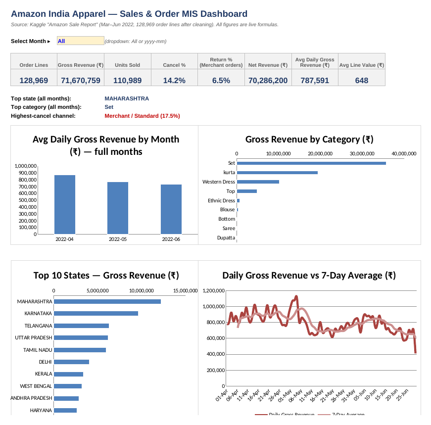
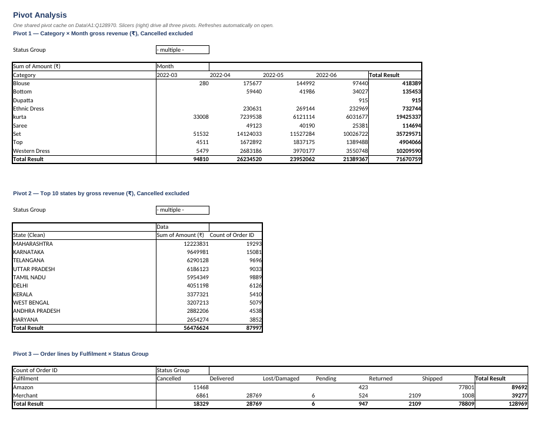

# Amazon Sales & Order MIS Report (Excel)

A formula-driven MIS workbook built on **128,969 order lines** from an Amazon India apparel seller (Mar–Jun 2022). It produces daily, weekly and monthly MIS reports, state/zone and category breakdowns, channel analysis, live data-quality checks, and a one-page dashboard with a month selector.

**Tools:** Microsoft Excel. SUMIFS, COUNTIFS, VLOOKUP, INDEX/MATCH, IFERROR, TRIM/UPPER, EOMONTH, RANK, SUMIF, named ranges, data validation, conditional formatting, charts, VBA.

## Dataset
[Amazon Sale Report – Kaggle](https://www.kaggle.com/datasets/thedevastator/unlock-profits-with-e-commerce-sales-data). One row = one SKU in an order. 128,975 raw rows; 128,969 after cleaning.

## Workbook structure
| Sheet | What it does |
|---|---|
| **Dashboard** | 8 KPIs driven by a month dropdown (All / yyyy-mm), top state/category/channel callouts, 4 charts |
| **Monthly / Weekly / Daily MIS** | Order lines, units, gross revenue, cancellations, returns, net revenue, avg line value, growth %, days of data |
| **State MIS** | 38 states/UTs ranked by revenue, revenue share with data bars, zone lookup, zone summary |
| **Category MIS** | Category metrics + Category × Month revenue matrix (colour scale) |
| **Channel MIS** | Amazon-fulfilled vs Merchant-fulfilled × service level |
| **Data Quality** | Live PASS/FAIL checks (unmapped statuses, blank amounts, revenue reconciliation) + cleaning log |
| **Data** | Cleaned order lines; Status Group and Clean State are lookup formulas |
| **Mappings** | Status → Status Group; 47 raw state spellings → clean state + zone |
| **Settings** | Alert thresholds (yellow input cells) that drive red/amber flags |
| **Guide** | Formula walkthrough, practice tasks, VBA macro |

## Data cleaning
- Removed 6 exact duplicate rows.
- Converted text dates (mm-dd-yy) to real dates, and added Month and Week Start (Monday) keys.
- Mapped 69 raw state spellings (e.g. `RJ`, `Rajshthan`, `rajasthan`) to 36 states/UTs plus APO and Unknown, using `VLOOKUP(TRIM(UPPER()))` against a mapping table.
- Grouped 13 order statuses into 6 groups: Delivered, Shipped, Pending, Cancelled, Returned, Lost/Damaged.
- Kept blank amounts blank (not zero) and flagged 229 non-cancelled lines with no amount.

## Key findings
- **Gross revenue ₹7.17 Cr**; cancellation rate **14.2%**.
- **Average daily revenue fell ~16% from April to June.** Daily order volume dropped ~20%, while average line value rose ~6% (₹626 → ₹660).
- **Merchant-fulfilled / Standard orders cancel at 17.5%**, vs 12.9% for Amazon-fulfilled / Expedited.
- **Maharashtra** is 17% of revenue; the **South zone** is 40%.
- **Set + Kurta** make up 77% of revenue.

## Limitations
- Return and Delivered statuses exist only for Merchant-fulfilled orders, so the Return % KPI is shown for Merchant orders only.
- March has one day of data (31-Mar) and the first/last weeks are partial. Growth % therefore uses average daily revenue.
- "Order Lines" counts SKU lines, not unique orders (120,378 unique Order IDs).

## Screenshots




## Pivot Analysis & Slicers
The **Pivot Analysis** sheet (after Channel MIS) holds three PivotTables. All three are built on **one shared pivot cache** (`Data!A1:Q128970`), so the data is cached once, one refresh updates all three, and one slicer can filter every pivot.

| Pivot | Rows × Columns | Values | Filter |
|---|---|---|---|
| `ptCategoryMonth` | Category × Month | Sum of Amount (₹), `#,##0` | Status Group ≠ Cancelled |
| `ptTopStates` | State (Clean), sorted descending | Sum of Amount (₹) + Count of Order ID | Status Group ≠ Cancelled, Top 10 value filter |
| `ptChannel` | Fulfilment × Status Group | Count of Order ID | none |

- **Slicers:** Fulfilment and Month, each connected to all three pivots through Report Connections.
- **Reconciliation block:** `GETPIVOTDATA` minus the formula reports. All four differences are **0 / PASS**:
  - Pivot 1 grand total **₹71,670,759** = `'Category MIS'` TOTAL = `Dashboard!C8`.
  - All 36 Category × Month cells match the `'Category MIS'` matrix.
  - The May-2022 column **₹23,952,062** = `'Monthly MIS'` May gross revenue (the slicer test).
- **What the pivots show:**
  - The top 10 states bring in ₹5.65 Cr, about 79% of gross revenue.
  - Merchant-fulfilled orders cancel at 17.5% (6,861 of 39,277 lines), against 12.8% for Amazon-fulfilled orders (11,468 of 89,692).
- Pivots are set to refresh on open.

## XLOOKUP cross-check
- **`Data!R` "Status Group (INDEX/MATCH)"** re-derives each status group independently of the VLOOKUP in column F:
  `=IFERROR(INDEX(Mappings!$B$5:$B$17,MATCH(E2,Mappings!$A$5:$A$17,0)),"UNMAPPED")`
  It uses INDEX/MATCH so it runs in Excel 2016. In Excel 2021 / 365, the XLOOKUP equivalent is
  `=XLOOKUP(E2,Mappings!$A$5:$A$17,Mappings!$B$5:$B$17,"UNMAPPED")`.
- **Data Quality check #11** counts mismatches between the two lookups: `=SUMPRODUCT(--(Data!F2:F128970<>Data!R2:R128970))`. Result: **0 / PASS** across 128,969 rows.

## Automation (VBA)
The `.xlsm` version contains module **`modMIS`** and a **Refresh & Export PDF** button on the Dashboard (next to F5).

```vba
Sub RefreshAndExportMIS()
    Dim f As String
    Application.CalculateFull                       ' recalc every formula
    ThisWorkbook.RefreshAll                         ' refresh the pivot cache (all 3 pivots)
    f = ThisWorkbook.Path & "\MIS_Dashboard_" & Format(Date, "yyyy-mm-dd") & ".pdf"
    ThisWorkbook.Sheets("Dashboard").ExportAsFixedFormat Type:=xlTypePDF, Filename:=f
    MsgBox "Dashboard exported: " & f
End Sub
```

Each click writes a dated PDF of the Dashboard next to the workbook.

## Files
| File | Contents |
|---|---|
| `Amazon_Sales_MIS_Report.xlsx` | Full workbook, **no macros** (safe to open anywhere) |
| `Amazon_Sales_MIS_Report.xlsm` | Same workbook **plus** the `modMIS` macro and the export button |

## How to use
1. Open in Excel 2016 or later. Formulas calculate on open.
2. Pick a month in **Dashboard!C5**.
3. Change thresholds in **Settings** to change the alert flags.
4. Optional: paste the macro from the **Guide** sheet into a module, save as `.xlsm`, and run `RefreshAndExportMIS` to export the dashboard as a PDF.
